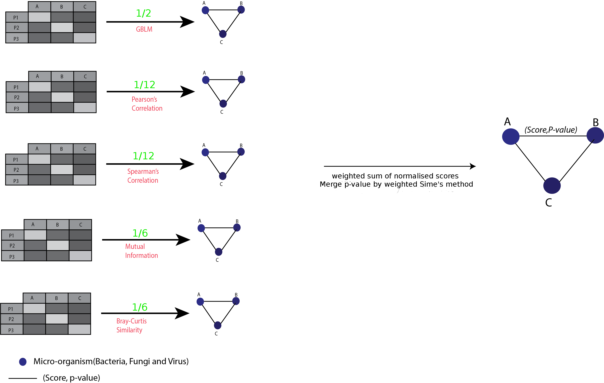

# INTEGRATIVE MICROBIOMICS REVEALS A DISRUPTED INTERACTOME IN BRONCHIECTASIS EXACERBATIONS
---
This document illustrates the use of the codes to implement the methods described in the article "Integrative Microbiomics reveals a disrupted interactome in bronchiectasis exacerbations".
## Table of contents
1. [Pre requisites](#pre-requisities)
2. [Similarity Network Fusion(SNF)](#similarity-network-fusion)
    1. [Single Biome Clustering](#single-biome-clustering)
    2. [Dual Biome Clustering](#dual-biome-clustering)
    3. [Merged Biome Clustering](#merged-biome-clustering)
3. [Weighted SNF](#weighted-snf)
4. [Co-occurence analysis](#co-occurence-analysis)
    1. [Cross-sectional co-occurence analysis](#cross-sectional-co-occurence-analysis)
    2. [Longitudinal co-occurence analysis](#longitudinal-co-occurence-analysis)
    3. [Differential network analysis](#differential-network-analysis)
    4. [Non-metric Dimensionality Scaling](#non-metric-dimensionality-scaling)
5. [Anti-biotic action modelling](#anti-biotic-action-modelling)
## Pre requisites
You will need the following softwares and packages to run the codes.
For Linux systems, Run the following 
```
sudo apt-get update && apt-get install -y python2.7 \
	python-pip \
	libcurl4-openssl-dev \
	libopenblas-base \
	gdebi-core \
	wget \
	default-jdk\
	gfortran\
	r-base
```
1. Python 2.7
    - [pandas](https://pandas.pydata.org/)
    - [numpy](https://numpy.org/)
    - [sklearn](https://scikit-learn.org/stable/index.html)
    - [seaborn](https://seaborn.pydata.org/)
    - [matplotlib](https://matplotlib.org/)
2. R 3.5.1
    - [SNFtool](https://cran.r-project.org/web/packages/SNFtool/index.html)
    - [vegan](https://cran.r-project.org/web/packages/vegan/index.html)
    - [dunn.test](https://cran.r-project.org/web/packages/dunn.test/index.html)
    - [reticulate](https://cran.r-project.org/web/packages/reticulate/index.html)
    - [mboost](https://cran.r-project.org/web/packages/mboost/index.html)
    - [boot](https://cran.r-project.org/web/packages/boot/boot.pdf)
    - [gMCP](https://cran.r-project.org/web/packages/gMCP/index.html)
    - [minet](https://www.bioconductor.org/packages/release/bioc/html/minet.html)

**Note:**
For windows and other operating system try running [this docker image](https://hub.docker.com/repository/docker/jayanthkumar/co-occurance_analysis), to implement co-occurence analysis and install all the following packages onto the docker container for implementation of other analyses.
1. Python 2.7
    - [sklearn](https://scikit-learn.org/stable/index.html)
    - [seaborn](https://seaborn.pydata.org/)
    - [matplotlib](https://matplotlib.org/)
2. R 3.5.1
    - [SNFtool](https://cran.r-project.org/web/packages/SNFtool/index.html)
    - [reticulate](https://cran.r-project.org/web/packages/reticulate/index.html)

The datasets used in the article are available in the `./Data` directory.
## Similarity Network Fusion
Navigate to `./SNF_Analysis` 
``` bash
SNF_Analysis
├── Dual_biome_clustering
│   ├── modified_est-cluster.R
│   ├── results
│   ├── snf.R
│   └── Tuning_k
├── Merged_biome_clustering
│   ├── results
│   ├── snf.R
│   └── Tuning_k
├── sil.py
└── Single_biome_clustering
    ├── modified_est-cluster.R
    ├── results
    └── snf.R
```
### Single biome clustering
___
To run single biome clustering, execute the below command
``` bash 
cd Single_biome_clustering/
Rscript snf.R
```
This code creates a similarity network of patients, with edge weights representing the Bray-Curtis similarity of the microbes between patients. This network is then clustered using spectral clustering. The optimal number of clusters is found using the Eigen-gap method. The results of the analysis, i.e. the cluster labels and similarity matrices  are written into the `results` directory as `./results/*_labels.csv` and `./results/*_matrix.csv` where `*` represents bacteria, fungi or virus datasets.   

Spectral-Clustering is similarity based clustering algorithm that can be implemented on any similarity graph G to identify clusters in the vertex set V of the graph G. It uses eigenvalues of the Laplacian matrix computed using the adjacency matrix(similarity matrix) of G to perform dimensionality reduction before clustering them in lower dimensions using k-means.

**Calculating the silhouette scores of the clusters**

To calculate the silhouette scores, we use the function `silhouette_score` defined in `./results/sil.py`.
The silhouette score for each object 'i', was defined in terms of similarities using the formula


The following python code can be used to calculate the average silhouette values of the clusters
```python
import sil
arr=pandas.read_csv("filename")
labels=pandas.read_csv("labels")
silhouette_score(arr,labels)
```
### Dual biome clustering
___
To regenerate clustering results of dual biome merging, i.e "bacteria+fungi", "fungi+virus" and "virus+bacteria", execute the below command
```bash
cd Dual_biome_clustering/
Rscript snf.R
```
This code uses [Similarity Network Fusion(SNF)](https://www.nature.com/articles/nmeth.2810) to merge 2 microbiomes and clusters the integrated biome using spectral clustering. The results of the analysis, i.e. the cluster labels and similarity matrices  are written into the `results` directory as `./results/*_labels.csv` and `./results/*_matrix.csv` where `*` represents "bacteria+fungi", "fungi+virus"..etc datasets.   

**Silhouette scores of the clusters can be computed as described above**
### Merged biome clustering
___
To regenerate clustering results of integrated microbiome , i.e "bacteria+fungi+virus", execute the below command
```bash
cd Merged_biome_clustering/
Rscript snf.R
```
This code uses [Similarity Network Fusion(SNF)](https://www.nature.com/articles/nmeth.2810) to integrate all three microbiomes and cluster them using spectral clustering. The results of the analysis, i.e. the cluster labels and similarity matrices are written into the `results` directory as `./results/labels.csv` and `./results/matrix.csv`.
___
## Weighted SNF
The weighted SNF analysis codes are to executed similar to SNF analysis codes as described above, i.e. execute the following command from the 
```bash
cd wSNF_Analysis/Merged_biome_clustering
Rscript wsnf.R
```
Below is the directory structure of `./wSNF_Analysis`
```
wSNF_Analysis
└── Merged_biome_clustering
    ├── function_snf.R
    ├── results
    ├── sil.py
    └── wsnf.R
```
`SNF_weighted_iter` function of `function_snf.R` is the modified similarity network fusion that accounts for weights.  
Equation (7) of [Similarity Network Fusion(SNF)](https://www.nature.com/articles/nmeth.2810) was modified as below to include weights where  is the weight of microbiome 'k'. Other parameters are as defined in the paper.


**Note:** weighted SNF needs atleast 3 similarity matrices 
___
## Co-occurence analysis

This section illustrates the implementation of co-occurence analysis as described in the article. Below is the directory structure
```
Co-occurance_Analysis
├── Cross-sectional
│   ├── Co-occurance_filter
│   │   ├── Bray-Curtis
│   │   ├── collate.py
│   │   ├── Cytoscape_Visuvalization
│   │   ├── GBLM
│   │   ├── Merge_p-val_scores
│   │   ├── MI
│   │   ├── Microbes.csv
│   │   ├── Pearsons
│   │   ├── run.sh
│   │   └── Spearman
│   └── Co-occurance_no_filter
│       ├── Bray-Curtis
│       ├── collate.py
│       ├── Cytoscape_Visuvalization
│       ├── GBLM
│       ├── Merge_p-val_scores
│       ├── MI
│       ├── Microbes.csv
│       ├── Pearsons
│       ├── run.sh
│       └── Spearman
└── Longitudinal
    ├── Co-occurance_Analysis
    │   ├── Bray-Curtis
    │   ├── collate.py
    │   ├── Cytoscape_Analysis
    │   ├── GBLM
    │   ├── Merge_p-val_scores
    │   ├── MI
    │   ├── Microbes.csv
    │   ├── Pearsons
    │   └── Spearman
    ├── Interactome_Stability_Analysis
    │   ├── differential_matrix_creator.py
    │   └── Figure.png
    ├── Longitudinal_Data
    └── NMDS
        ├── function_snf.R
        ├── NMDS_wSNF.R
        ├── Pre_processed_data
        ├── pre_processes.py
        └── sil.py
```
Below is an illustration of the co-occurence method implemented
<p align="center"></p>

## Cross-sectional co-occurence analysis
---
This part of the documentation represents how to implement the co-occurence analysis on n=217 patients of the CAMEB cohort, with and without filtering(Microbes must be prevalent in atleast 5% of the patients at an abundance of 1%) the Microbial dataset.

Execute `python collate.py` from the `./Co-occurance_filter` directory to collate the dataset and to apply the filter and for unfiltered version of co-occurence analysis execute `python collate.py` from the `./Co-occurance_no_filter` this does not apply the filter.

`python collate.py` outputs `Microbes.csv` the base data that the program uses

**Co-occurence networks from different measures**
Execute the following shell script
```bash
chmod +x runs.sh
./run.sh
```
Running this would populate the results of different measures into their respective directories.
To merge these co-occurence networks
```bash
cd ./Merge_p-val_scores/
#Set the variable "cluster" to "cluster1" in Merge.R
Rscript Merge.R 
#Set the variable "cluster" to "cluster2" in Merge.R
Rscript Merge.R 
python Adjacency_matrix_creator.py
```
The above code would result in outputs `cluster1_Adj_cyto.csv` and `cluster2_Adj_cyto.csv` which are then imported into cytoscape using an adjacency matrix reader for further downstream processing.

## Longitudinal co-occurence analysis
---
The dataset used for longitudinal interactome analysis is available in ```./Longitudinal_Data``` directory.
Execute ```python collate.py``` to collate the datasets together.
To run this analysis run the following commands
```bash
cd ./Bray-Curtis/
Rscript bray-curtis.R #Set the cluster variable(dd) to the interested cluster
cd ./../GBLM/
Rscript GBLM.R #Set the cluster variable(data) to the interested cluster
cd ./../MI/
Rscript MI.R #Set the cluster variable(data) to the interested cluster
cd ./../Pearsons/
Rscript pearsons.R #Set the cluster variable(data) to the interested cluster
cd ./../Spearman/
Rscript spearman.R #Set the cluster variable(data) to the interested cluster
#To merge the networks from different measures
cd ./../Merge_p-val_scores/
Rscript Merge.R #Set the cluster variable to the interested cluster
python Adjacency_matrix_creator.py #Creates the adjacency matrix to be passed to Cytoscape
```

## Differential network analysis
---
To implement differential network analysis navigate to ```./Interactome_Stability_Analysis``` and execute the script ```differential_matrix_creator.py``` as ```python differential_matrix_creator.py```

 Let  denote the interaction between microbes "a" and "b" in "i", where  (Baseline, Exacerbation, Post Exacerbation), then we define the differential score as, 

## Non-metric Dimensionality Scaling
---
To assess the beta-diversity we implement NMDS analysis. To run this analysis navigate to ```./NMDS``` directory and execute the following commands
```bash
python pre_processes.py #Preprocesses the data 
Rscript NMDS_wSNF.R 
```
We pre-process the dataset to remove microbes that are not present in atleast 5% of the samples. We implement wSNF at each time point, say  are the integrated similarity matrices from Baseline, Exacerbation and Post-exacerbation. We then implement NMDS using  as the disimilarity index, since 0.5 is the maximum value the integrated similarity matrix can take.
## Anti-biotic action Modelling
---
##### Additional Requirements
1.  python 3.6.9
    - py2cytoscape 
    - pandas

To model the action of antibiotic -lactum.
We considered 12 patients from the Longitudinal cohort who had been given a beta-lactum. Navigate to the ```./antibiotic-sim``` directory and Run the following
```bash
python3 collate.py
```
This code selectes these 12 patients, reduces the relative abundance of the microbes by 75% that are affected by beta-lactum and applies the abundance-prevalance filter so as to keep only microbes that are atleast 1% abundant and prevalent in atleast 3 patients in the in the pre OR post OR modeled antibiotic state. This would produce three files "Microbes_pre.csv", "Microbes_post.csv" and "Microbes_75%_reduction.csv" denoting the pre, post and modeled antibiotic state.

We implement co-occurence analysis on these three files as described in the above section. The output adjacency matrix is stored in the directory ```./Co-occurence_results```

Cytoscape was used to import these adjaceny matrix using the *aMatReader* App. Network metrics such as node degree, stress centrality and betweeness centrality was calculated using the *Network Analyser* App. These results are saved as ```* node metrics.csv```. *Diffany* App was used to implement differential network analysis with pre-antibiotic interactome as reference. The edge table from the diffany analysis was exported as ```diffany_* edge weights.csv```

Since the output edge table from *Diffany* don't have the edges named. A python script ```cytoscape_name.py``` which uses the Cyrest API was implemented to name the edges based on the nodes each edge connects. The resulting modified edge table was then exported back as ```diffany_* edge weights.csv```. 

```count_sim.py``` was then implemented to calculate the percentage(%) of the modeled interactome edges that are present in the actual post-antibiotic interactome.
